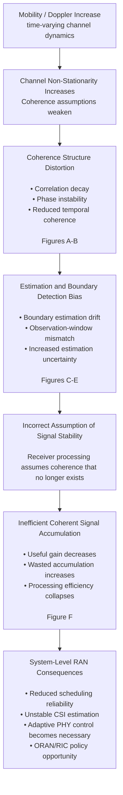

# doppler-coherence-analysis

Doppler Coherence Analysis in Mobility-Aware Signal Processing Systems

## Related Technical Note

For a broader system-level interpretation of Doppler coherence behavior in UAV and 6G systems:

👉 https://haripriyap.github.io/2026/05/11/uav-phy-breakdown.html

## Conceptual Flow of the Study



The repository investigates how mobility-induced Doppler dynamics propagate through multiple layers of receiver processing. 
The analysis connects waveform-level coherence degradation to estimation bias and ultimately to system-level efficiency loss under mobility.

## 1. Project overview

Abstract
This repository investigates the impact of Doppler-induced time-variability on coherence estimation 
and its downstream effects on signal processing reliability in mobile wireless systems. 
In practical receivers, mobility introduces non-stationarity that degrades the assumption of locally stable channel statistics. 
This work focuses on quantifying how Doppler dynamics influence coherence estimation accuracy, boundary stability, and 
efficiency of signal accumulation under varying mobility conditions.

Through simulation-driven analysis, we characterize the relationship between Doppler spread, observation window length, and coherence degradation. 
The results highlight systematic bias in boundary estimation and identify regions where coherent integration becomes inefficient or misleading under high mobility.

Problem Statement
Modern wireless receivers rely on the assumption of quasi-stationary channels over short observation windows. 
However, in high-mobility scenarios, Doppler shifts introduce time-selective fading, violating this assumption.

This leads to three key challenges:

Degradation of coherence estimation accuracy
Instability in boundary detection of correlation structure
Reduced efficiency in signal accumulation under mobility
This work studies these effects in a controlled simulation framework.

## 2. System Model (Conceptual)
We consider a time-varying wireless channel influenced by mobility-induced Doppler shifts. The received signal exhibits time-dependent phase rotation and correlation decay governed by Doppler frequency.

Key assumptions:

Narrowband or subcarrier-level analysis
Time-limited observation windows
Stationary processing assumed within each window (approximation)
The focus is on how violation of stationarity affects coherence-based inference metrics.

## 3. Objectives
This study aims to:

Quantify coherence degradation as a function of Doppler shift
Analyze estimation error in boundary detection of correlation structure
Evaluate efficiency loss in signal accumulation under mobility
Identify regimes where standard coherence assumptions fail

## 4. Methodology
The analysis is performed through simulation-based evaluation using Python.

Core steps:

Generate Doppler-affected signal realizations
Compute coherence / correlation metrics over sliding observation windows
Estimate boundary transitions in correlation stability
Measure deviation from theoretical or low-mobility baseline behavior
Evaluate efficiency of accumulated signal energy under mobility

## 5. Key Observations
The following behaviors are consistently observed:

Coherence degradation increases non-linearly with Doppler
Boundary estimation becomes biased under high mobility
Short observation windows reduce bias but increase variance
Long observation windows introduce averaging artifacts under Doppler dynamics
A trade-off exists between stability and responsiveness in coherence estimation

## 6. Results Overview

The results are organized into three conceptual layers:

### 6.1 Channel-level impact of Doppler (Figures A–B)

These figures characterize how mobility alters signal stationarity and coherence structure at the waveform level.

### 6.2 Estimation-level distortion (Figures C–E)

These results demonstrate that Doppler-induced non-stationarity introduces systematic bias in coherence estimation and boundary detection, particularly under finite observation windows.

### 6.3 System-level efficiency degradation (Figure F)

This figure shows how estimation errors propagate into reduced efficiency of coherent signal accumulation, defining mobility regimes where standard processing assumptions fail.

## 7. Repository Structure

```text
doppler-coherence-analysis/
│
├── figures/              # Result plots and visual analysis
├── scripts/              # Simulation and computation modules
├── technical_note.pdf    # Mathematical and conceptual discussion
├── requirements.txt      # Python dependencies
└── README.md             # Repository overview
```

## 8. How to Run
Install dependencies:

pip install -r requirements.txt
Run main analysis:

python scripts/utils.py
Generate figures:

python scripts/generate_figures.py

## 9. Interpretation
This work emphasizes a key practical insight:

Coherence is not only a function of channel properties, but also of observation strategy under mobility.

In Doppler-dominated environments, estimation reliability is jointly determined by:

channel dynamics
observation window design
and inference methodology

## 10. Future Extensions
Potential directions for extension include:

Adaptive windowing strategies for Doppler tracking
ML-assisted coherence estimation under mobility
Integration with scheduling or link adaptation logic (ORAN-aligned direction)
Extension to MIMO spatial coherence degradation

## 11. Status⁵
This repository represents an exploratory research artifact bridging:

signal processing theory
mobility-aware channel modeling
coherence-based inference reliability

It is intended as a foundation for further research, system modeling, and potential standards-aligned contributions.


